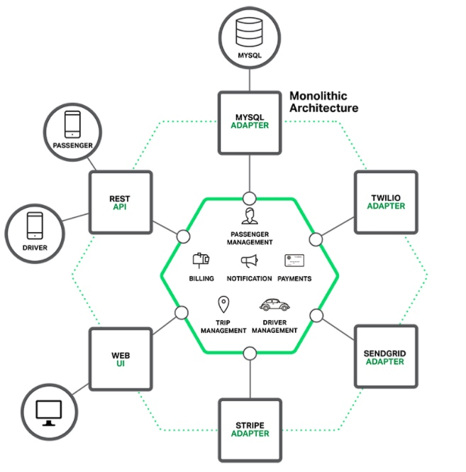
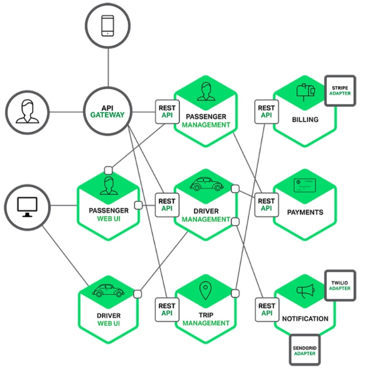
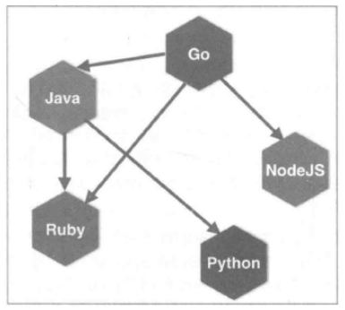
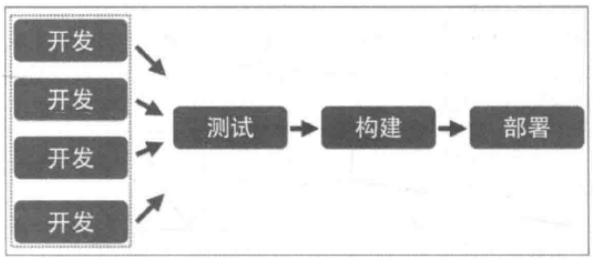
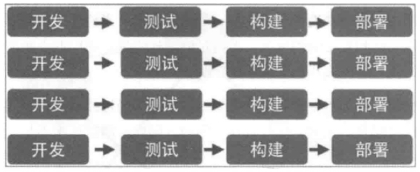
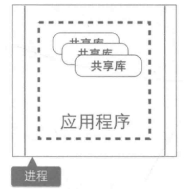
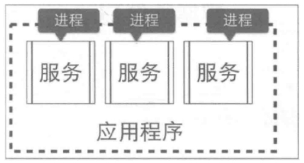

# 什么是微服务

> “简而言之，微服务架构风格是将单个应用程序作为一组小型服务开发的方法，每个服务程序都在自己的进程中运行，并与轻量级机制（通常是HTTP资源API）进行通信。这些服务是围绕业务功能构建的。可以通过全自动部署机器独立部署。这些服务器可以用不同的编程语言编写，使用不同的数据存储技术，并尽量不用集中式方式进行管理”

在介绍微服务时，首先得先理解什么是微服务，顾名思义，微服务得从两个方面去理解，什么是”微”、什么是”服务”？
**微（micro）** 狭义来讲就是体积小，著名的”2 pizza 团队”很好的诠释了这一解释（2 pizza 团队最早是亚马逊 CEO Bezos提出来的，意思是说单个服务的设计，所有参与人从设计、开发、测试、运维所有人加起来 只需要2个披萨就够了 ）。
**服务（service）** 一定要区别于系统，服务一个或者一组相对较小且独立的功能单元，是用户可以感知最小功能集。

那么广义上来讲，微服务是一种分布式系统解决方案，推动细粒度服务的使用，这些服务协同工作。

 Martin Flower 对微服务概念的系统化阐述，微服务有如下特征：

1. 微服务是一种架构风格，也是一种服务；
2. 微服务的颗粒比较小，一个大型复杂软件应用由多个微服务组成，比如 Netflix （国外最早基于云进行服务化架构改造的公司）由500多个的微服务组成；
3. 它采用 UNIX 设计的哲学，每种服务只做一件事，是一种松耦合的能够被独立开发和部署的无状态化服务（独立扩展、升级和可替换）

### 微服务与微服务框架

在这里我们可能混淆了一个点，那就是微服务和微服务架构，这应该是两个不同的概念，而我们平时说道的微服务可能就已经包含了这两个概念了，所以我们要把它们说清楚以免我们很纠结。微服务架构是一种设计方法，而微服务这是应该指使用这种方法而设计的一个应用。所以我们必要对微服务的概念做出一个比较明确的定义。

微服务框架是将复杂的系统使用组件化的方式进行拆分，并使用轻量级通讯方式进行整合的一种设计方法。

微服务是通过这种架构设计方法拆分出来的一个独立的组件化的小应用。

微服务架构定义的精髓，可以用一句话来描述，那就是“分而治之，合而用之”。

将复杂的系统进行拆分的方法，就是“分而治之”。分而治之，可以让复杂的事情变的简单，这很符合我们平时处理问题的方法。

使用轻量级通讯等方式进行整合的设计，就是“合而用之”的方法，合而用之可以让微小的力量变动强大。

# 微服务的优势

想要直接描述微服务比较困难，我们可以通过对比传统WEB应用，来理解什么是微服务。

传统的WEB应用核心分为业务逻辑、适配器以及API或通过UI访问的WEB界面。业务逻辑定义业务流程、业务规则以及领域实体。适配器包括数据库访问组件、消息组件以及访问接口等。一个打车软件的架构图如下：

**三层架构（MVC）的具体内容如下：**
**表示层（view）**： 用户使用应用程序时，看到的、听见的、输入的或者交互的部分。
**业务逻辑层（controller）**： 根据用户输入的信息，进行逻辑计算或者业务处理的部分。
**数据访问层（model）**： 关注有效地操作原始数据的部分，如将数据存储到存储介质（如数据库、文件系统）及从存储介质中读取数据等。
虽然现在程序被分成了三层，但只是逻辑上的分层，并不是物理上的分层。也就是说，对不同层的代码而言，经过编译、打包和部署后，所有的代码最终还是运行在同一个进程中。而这，就是所谓的单块架构。例如Java应用程序会被打包成WAR，部署在Tomcat或者Jetty上。

这种单体应用比较适合于小项目，优点是：

- 开发简单直接，集中式管理
- 基本不会重复开发
- 功能都在本地，没有分布式的管理开销和调用开销

单体架构在规模比较小的情况下工作情况良好，但是随着系统规模的扩大，它暴露出来的问题也越来越多，主要有以下几点：

**复杂性逐渐变高**

比如有的项目有几十万行代码，各个模块之间区别比较模糊，逻辑比较混乱，代码越多复杂性越高，越难解决遇到的问题。

**技术债务逐渐上升**
公司的人员流动是再正常不过的事情，有的员工在离职之前，疏于代码质量的自我管束，导致留下来很多坑，由于单体项目代码量庞大的惊人，留下的坑很难被发觉，这就给新来的员工带来很大的烦恼，人员流动越大所留下的坑越多，也就是所谓的技术债务越来越多。

**维护成本大**
当应用程序的功能越来越多、团队越来越大时，沟通成本、管理成本显著增加。当出现 bug 时，可能引起 bug 的原因组合越来越多，导致分析、定位和修复的成本增加；并且在对全局功能缺乏深度理解的情况下，容易在修复bug 时引入新的 bug。

**持续交付周期长**
构建和部署时间会随着功能的增多而增加，任何细微的修改都会触发部署流水线。新人培养周期长：新成员了解背景、熟悉业务和配置环境的时间越来越长。

**技术选型成本高**
单块架构倾向于采用统一的技术平台或方案来解决所有问题，如果后续想引入新的技术或框架，成本和风险都很大。

**可扩展性差**
随着功能的增加，垂直扩展的成本将会越来越大；而对于水平扩展而言，因为所有代码都运行在同一个进程，没办法做到针对应用程序的部分功能做独立的扩展。

所以，现在主流的设计一般会采用微服务架构。其思路不是开发一个巨大的单体式应用，而是将应用分解为小的、互相连接的微服务。一个微服务完成某个特定功能，比如乘客管理和下单管理等。每个微服务都有自己的业务逻辑和适配器。一些微服务还会提供API接口给其他微服务和应用客户端使用。

比如，前面描述的系统可被分解为：

每个业务逻辑都被分解为一个微服务，微服务之间通过REST API通信。一些微服务也会向终端用户或客户端开发API接口。但通常情况下，这些客户端并不能直接访问后台微服务，而是通过API Gateway来传递请求。API Gateway一般负责服务路由、负载均衡、缓存、访问控制和鉴权等任务。

## 微服务架构的优势

**单一职责**

微服务架构中的每个服务，都是具有业务逻辑的，符合高内聚、低耦合原则以及单一职责原则的单元，不同的服务通过“管道”的方式灵活组合，从而构建出庞大的系统。

**轻量级通信**
服务之间通过轻量级的通信机制实现互通互联，而所谓的轻量级，通常指语言无关、平台无关的交互方式。

对于轻量级通信的格式而言，我们熟悉的 XML 和 JSON，它们是语言无关、平台无关的；对于通信的协议而言，通常基于 HTTP，能让服务间的通信变得标准化、无状态化。目前大家熟悉的 REST（Representational StateTransfer）是实现服务间互相协作的轻量级通信机制之一。使用轻量级通信机制，可以让团队选择更适合的语言、工具或者平台来开发服务本身。

问：REST是什么和restful一样吗？

答：REST 指的是一组架构约束条件和原则。满足这些约束条件和原则的应用程序或设计就是 RESTful。

**独立性**

每个服务在应用交付过程中，独立地开发、测试和部署。

在单块架构中所有功能都在同一个代码库，功能的开发不具有独立性；当不同小组完成多个功能后，需要经过集成和回归测试，测试过程也不具有独立性；当测试完成后，应用被构建成一个包，如果某个功能存在 bug，将导致整个部署失败或者回滚。

在微服务架构中，每个服务都是独立的业务单元，与其他服务高度解耦，只需要改变当前服务本身，就可以完成独立的开发、测试和部署。

**进程隔离**

单块架构中，整个系统运行在同一个进程中，当应用进行部署时，必须停掉当前正在运行的应用，部署完成后再重启进程，无法做到独立部署。
有时候我们会将重复的代码抽取出来封装成组件，在单块架构中，组件通常的形态叫做共享库（如 jar 包或者DLL），但是当程序运行时，所有组件最终也会被加载到同一进程中运行。

在微服务架构中，应用程序由多个服务组成，每个服务都是高度自治的独立业务实体，可以运行在独立的进程中，不同的服务能非常容易地部署到不同的主机上。

### 微服务架构的缺点

#### 运维要求较高

对于单体架构来讲，我们只需要维护好这一个项目就可以了，但是对于微服务架构来讲，由于项目是由多个微服务构成的，每个模块出现问题都会造成整个项目运行出现异常，想要知道是哪个模块造成的问题往往是不容易的，因为我们无法一步一步通过debug的方式来跟踪，这就对运维人员提出了很高的要求。

#### 分布式的复杂性

对于单体架构来讲，我们可以不使用分布式，但是对于微服务架构来说，分布式几乎是必会用的技术，由于分布式本身的复杂性，导致微服务架构也变得复杂起来。

#### 接口调整成本高

比如，用户微服务是要被订单微服务和电影微服务所调用的，一旦用户微服务的接口发生大的变动，那么所有依赖它的微服务都要做相应的调整，由于微服务可能非常多，那么调整接口所造成的成本将会明显提高。

#### 重复劳动

对于单体架构来讲，如果某段业务被多个模块所共同使用，我们便可以抽象成一个工具类，被所有模块直接调用，但是微服务却无法这样做，因为这个微服务的工具类是不能被其它微服务所直接调用的，从而我们便不得不在每个微服务上都建这么一个工具类，从而导致代码的重复。

|            | 传统单体架构           | 分布式微服务化架构                               |
| :--------- | :--------------------- | :----------------------------------------------- |
| 新功能开发 | 需要时间               | 容易开发和实线                                   |
| 部署       | 不经常而且容易部署     | 经常发布，部署复杂                               |
| 隔离性     | 故障影响范围大         | 故障影响范围小                                   |
| 架构设计   | 初期设计选型难度大     | 设计逻辑难度大                                   |
| 系统性能   | 相应时间快，吞吐量小   | 相应时间慢，吞吐量大                             |
| 系统运维   | 运维简单               | 运维复杂                                         |
| 新人上手   | 学习曲线大（应用逻辑） | 学习曲线大（架构逻辑）                           |
| 技术       | 技术单一而且封闭       | 技术多样而且开发                                 |
| 测试和差错 | 简单                   | 复杂（每个服务都要进行单独测试，还需要集群测试） |
| 系统拓展性 | 扩展性差               | 扩展性好                                         |
| 系统管理   | 重点在于开发成本       | 重点在于服务治理和调度                           |

### 为什么使用微服务架构

#### 开发简单

微服务架构将复杂系统进行拆分之后，让每个微服务应用都开放变得非常简单，没有太多的累赘。对于每一个开发者来说，这无疑是一种解脱，因为再也不用进行繁重的劳动了，每天都在一种轻松愉快的氛围中工作，其效率也会整备地提高

#### 快速响应需求变化

一般的需求变化都来自于局部功能的改变，这种变化将落实到每个微服务上，二每个微服务的功能相对来说都非常简单，更改起来非常容易，所以微服务非常是和敏捷开发方法，能够快速的影响业务的需求变化。

#### 随时随地更新

一方面，微服务的部署和更新并不会影响全局系统的正常运行；另一方面，使用多实例的部署方法，可以做到一个服务的重启和更新在不易察觉的情况下进行。所以每个服务任何时候都可以进行更新部署。

#### 系统更加稳定可靠

微服务运行在一个高可用的分布式环境之中，有配套的监控和调度管理机制，并且还可以提供自由伸缩的管理，充分保障了系统的稳定可靠性