最小割

选择

# 历年试题

## 2016

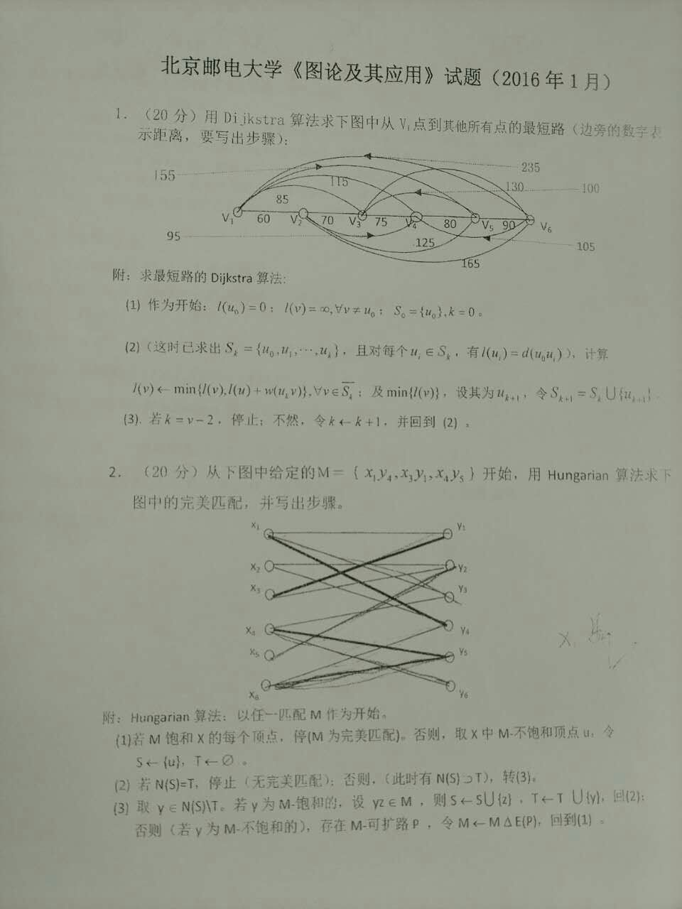
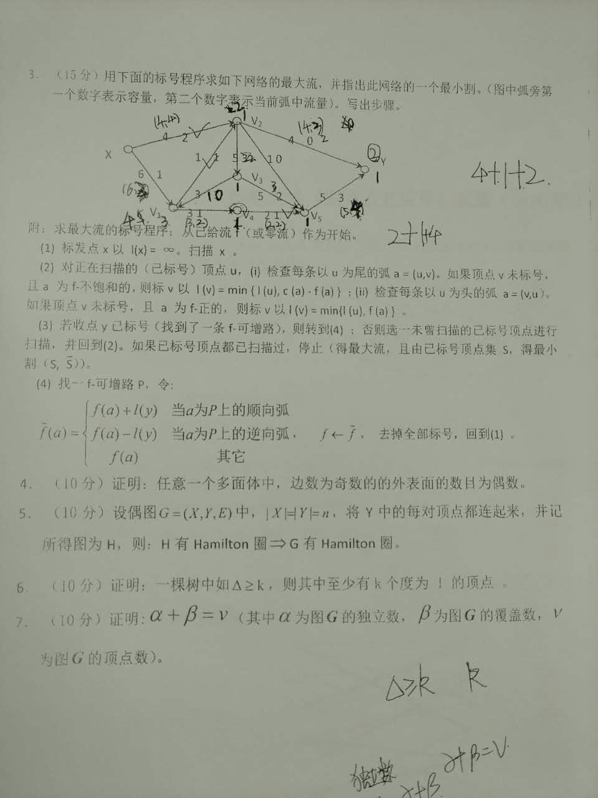

## 2017
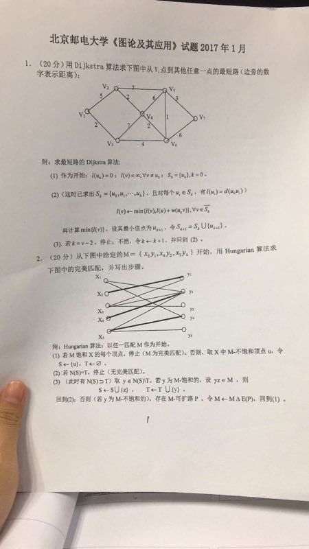

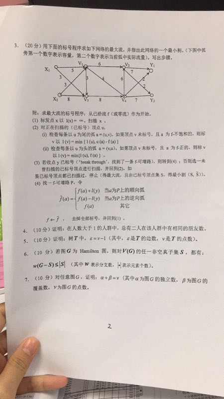

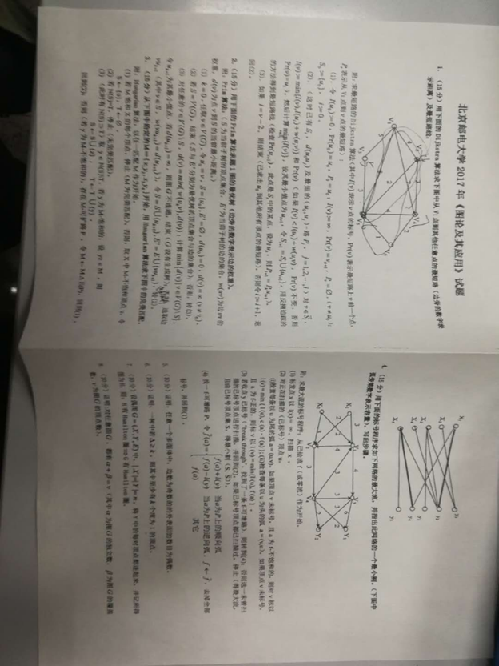

## 2018

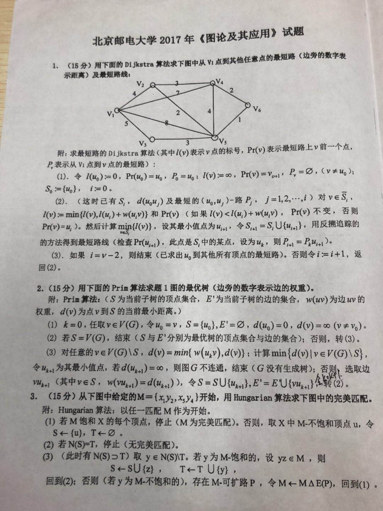
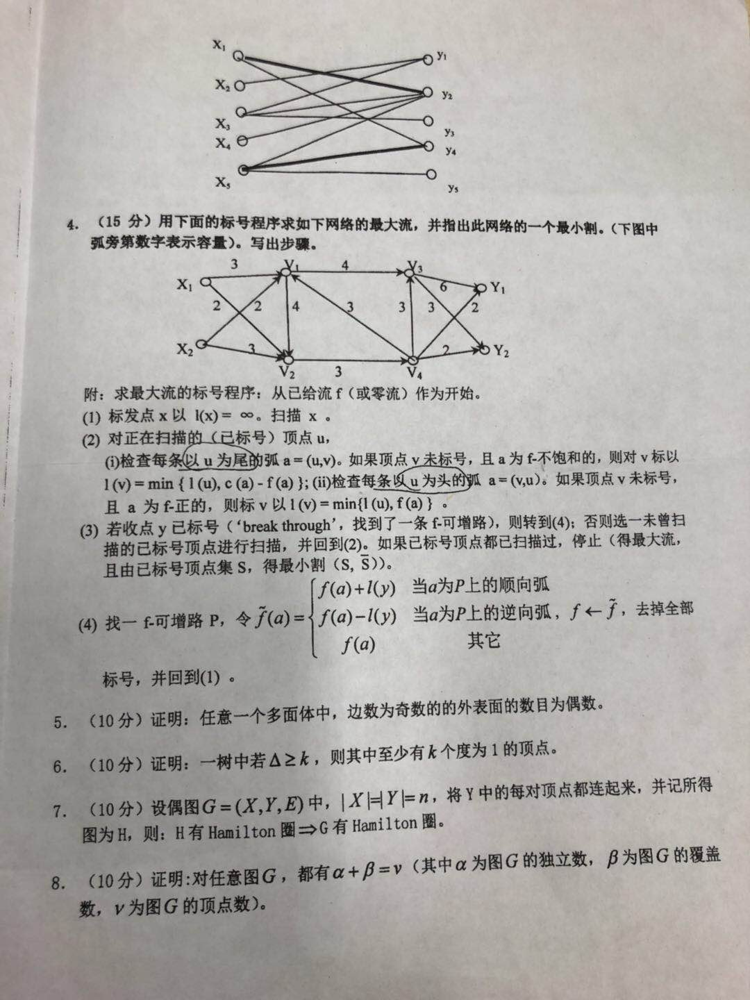
## 2019
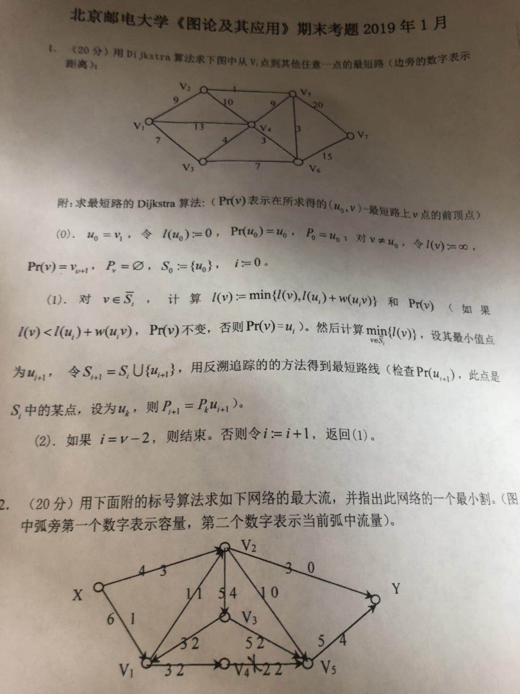
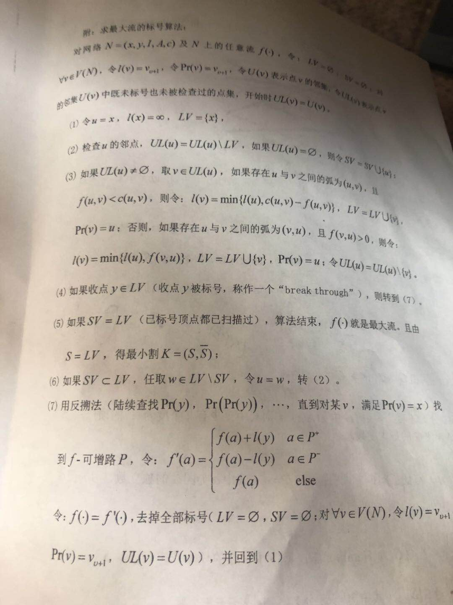
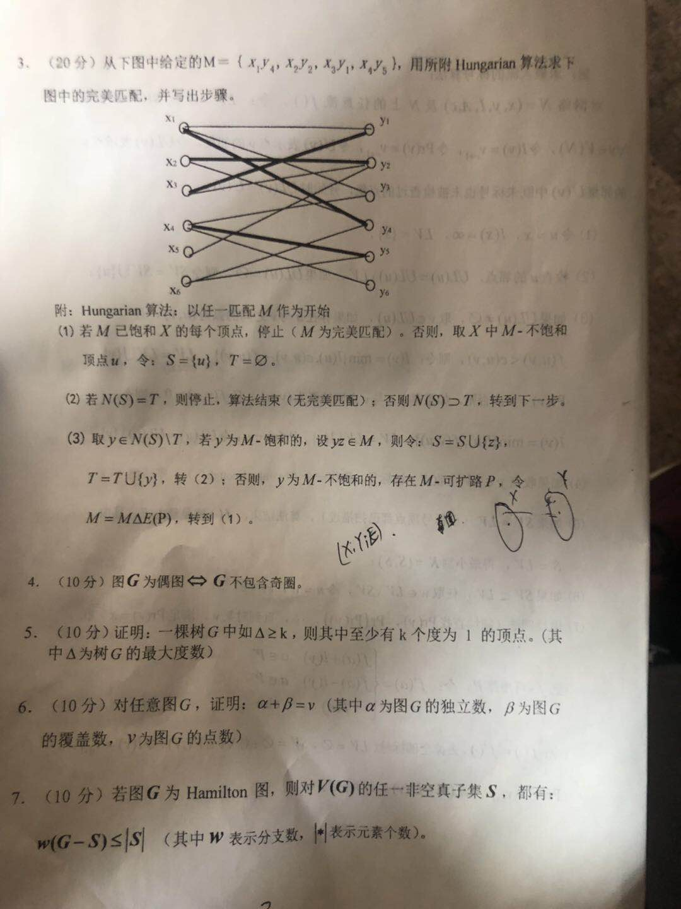

# 其他

## 论坛评论

> 期末题型我猜测是三道计算题，四道证明题。
> 先说计算题：根据我上课听讲的和往年试卷总结的，我猜测有三道计算题。总分60分，分别是：1.用Dijkstra算法求最短路;2.Hungarian算法求完美匹配;3.标号法求最大流。这三种算法只要会计算就行，建议从做例题学起。参考往年试卷。给出如下图三道例题，可供参考学习。
> 再说证明题：首先老师说证明题都是书上的定理和一道课后习题，我根据上课老师的重点和自己总结的，整理出了如下图的题目，供大家参考，同时建议对于看不懂的证明就直接背，反正也是原题。

> 据说去年除了这三道，还考了生成树prim算法
>

>1.先附上试卷三道计算题自己的求解。
2.关于其他的算法：染色法判断偶图就直接背方法就行了，考试如果考到也估计是要我们写出判断偶图的算法。最小生成树算法：Kruskal和prim算法，我觉得较为简单，就没有细说。
3.我的初衷是帮助怕过不了的同学能够及格，所以说的不太全面，如果你想考高分，那肯定事把所有的算法和定理例题都理解好。

> 完美匹配这里好像做错了吧？x2和x5的邻域是y2和y4吧，这里不等于T{y2}，可以继续。

> 首先，理解老师讲的例题，动手写一遍，最好是按照老师的步骤写。然后，做往年试卷，一定一定要自己独立做一遍，保证自己是真的会了，这里一定一定要注意细节和步骤。证明题，仔细看一遍的话，应该能理解个差不多，然后背一背，去年考试证明题没考太长的，考的都是他上课重点讲过的

> 图论这个课是考试题出的简单，但你不用他最后两节课复习讲的方法而是用网上的方法做的话，就不得分，运气好点60飘过

## 例题

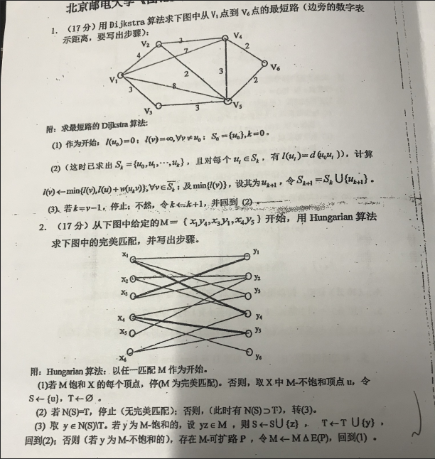

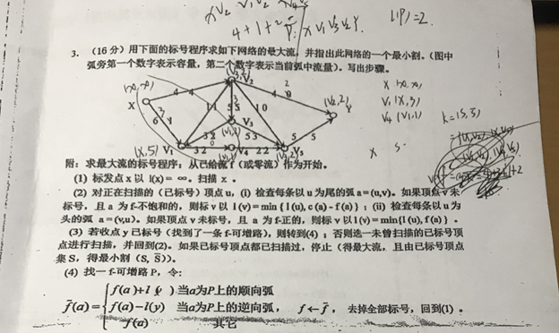

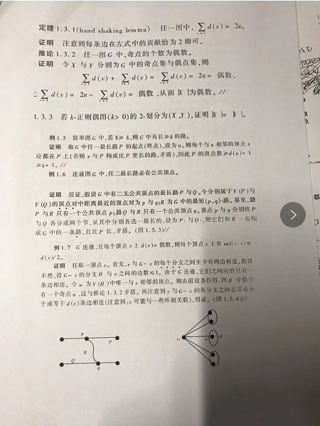

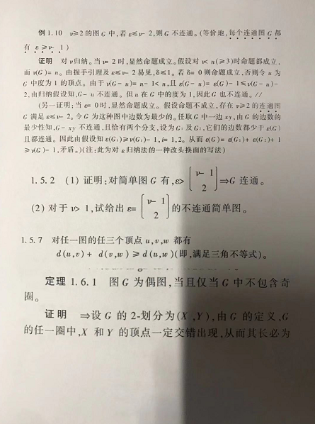

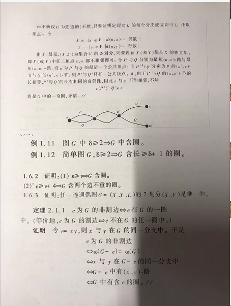

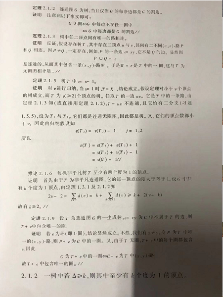

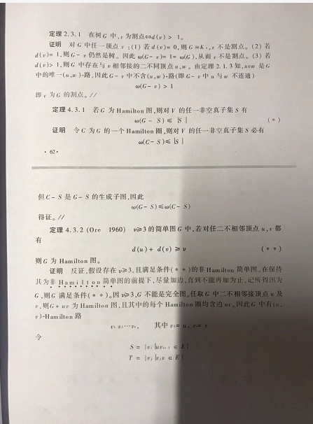

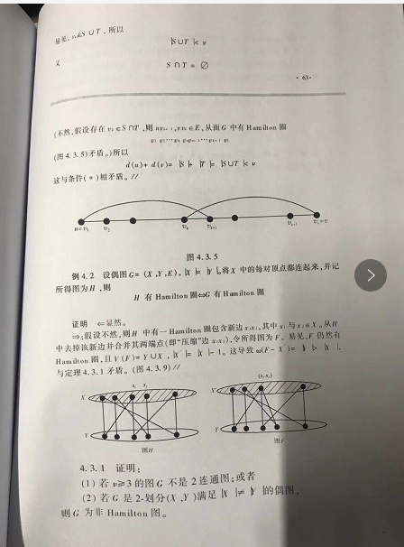

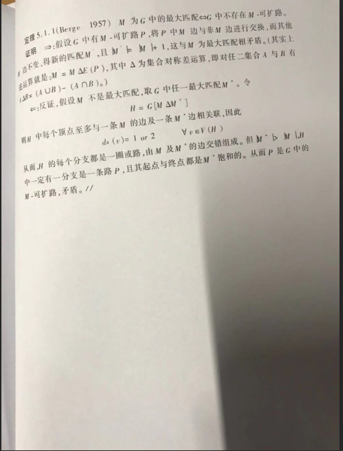

