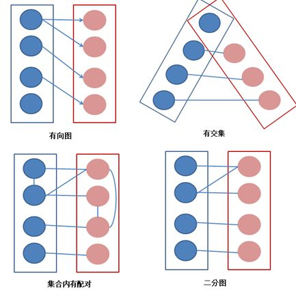
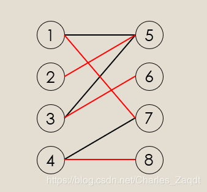
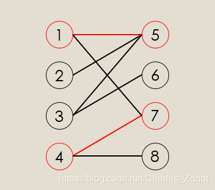
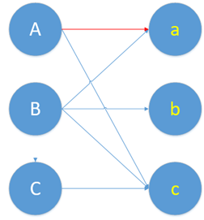
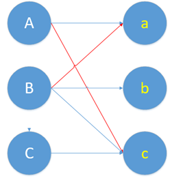
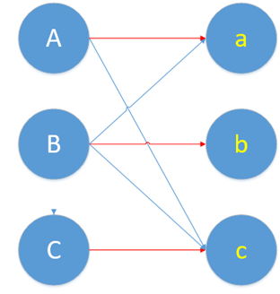
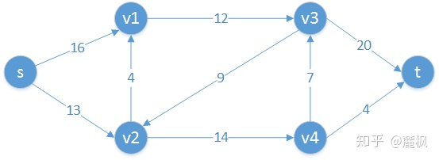
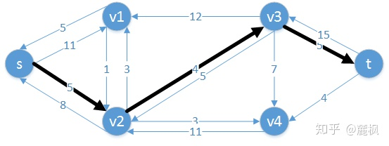

# 二部图 匈牙利算法

## **二部图定义：**

二部图又称作二分图，是图论中的一种特殊模型。 设G=(V,E)是一个无向图，如果顶点V可分割为两个互不相交的子集(A,B)，并且图中的每条边（i，j）所关联的两个顶点i和j分别属于这两个不同的顶点集(i in A,j in B)，则称图G为一个二分图。简而言之，就是顶点集V可分割为两个互不相交的子集，并且图中每条边依附的两个顶点都分属于这两个互不相交的子集，两个子集内的顶点不相邻。

对于二分图的判断方法最常见的是染色法，顾名思义就是我们对每一个点进行染色操作，我们只用黑白两种颜色，问能不能使所有的点都染上了色，而且相邻两个点的颜色不同，如果可以那么这个图就是一个二分图。

【解释】一张图要是二分图，需要满足以下几个要求：

（1） 无向图。 意思就是没有方向，一旦AB俩人有连线，就说明俩人相互喜欢，配对成功，不存在A单方面喜欢B的情况。

（2） 交集为空。意思就是男的是一个集合，女的是一个集合。不存在男生集合里混入女生的情况。

（3） 任意边的两个端点分属于两个集合。意思就是，男的只能和女的配对。任何男的不能和男的配对，任何女的不能和女的配对。

**二部图匹配：**

给定一个二分图G，在G的一个子图M中，M的边集{E}中的任意两条边都不依附于同一个顶点，则称M是一个匹配。极大匹配(Maximal Matching)是指在当前已完成的匹配下,无法再通过增加未完成匹配的边的方式来增加匹配的边数。最大匹配(maximum matching)是所有极大匹配当中边数最大的一个匹配。选择这样的边数最大的子集称为图的最大匹配问题。**如果一个匹配中，图中的每个顶点都和图中某条边相关联，则称此匹配为完全匹配**，也称作完备匹配。求二分图匹配可以用最大流(Maximal Flow)或者匈牙利算法(Hungarian Algorithm)。
**完全匹配一定是极大匹配，但是极大匹配不一定是完全匹配**。下图就是一个最大匹配。红色是子图M匹配

**二部图最大匹配：**

给定一个二分图G，在G的一个子图M中，M的边集中的任意两条边都不依附于同一个顶点，则称M是一个匹配。选择这样的边数最大的子集称为图的最大匹配问题（maximal matching problem)。

【解释】结合情侣配对问题，男生女生之间互生情愫的有很多，甚至有的人对多个人都有意向，因此潜在的情侣组合方式有很多种。所谓的“任意两条边都不依附于同一个顶点”，意思就是只要我们撮合的时候，不要给某个人安排两个对象就行。作为牵线人，我们可以撮合一对，也可以撮合两对，这样每一种撮合方式，都叫一个匹配。撮合成功的这些情侣就是所谓的子图M。

按照上面的撮合方式，我们既不能把没有意向的两个人撮合在一起，有的人又对多个人有意向，因此可以花一点心思，尽可能地协调一下大家的意向，做到多撮合成功几对。这样，成功撮合的情侣最多的这种撮合方式，就叫最大匹配。

如果非常幸运，在我们的安排下，每个人都找到了自己心仪的对象。这种撮合方式，叫做最优匹配或完美匹配。

**首先我们先了解两个概念**

交替路：从一个未匹配的点出发，依次经过未匹配边、匹配边、未匹配边....这样的路叫做交替路。

增广路：从一个未匹配的点出发，走交替路，**到达了一个未匹配过的点**，这条路叫做增广路。
看下图，其中1、4、5、7是已经匹配的点，1->5,4->7是已经匹配的边，那么我们从8开始出发，8->4->7->1->5->2这条路就是一条增广路。

## 匈牙利算法

考虑一个下面这个二分图，怎么找到最大的匹配呢？

一个自然的思路是，一个一个的配对。首先给A配对。一看A和a有意向，那就先把他俩撮合到一起。

现在效果就变成这样了。

蓝色的是他们本身有意向的情况，就是原始二分图，要记得蓝线连一块并不叫“匹配边”，而是“非匹配边”。红色的是我们给他们配对了，红线才叫“匹配边”。

好了，A的问题暂时性解决了，轮到B了。结果b也想和a配对。

**这时候，谁才能和a在一起呢？交替路和增广路就是解决这个冲突的。** 

这时候，我们要找一条交替路，就是依次经过非匹配边（蓝线）、匹配边（红线）。那么我们从B出发，开始找交替路了。我们找到了

（非匹配边） (匹配边) (非匹配边)

B--------------a----------------A-----------------c

B和c都是没有被匹配过的点，而它又是这条交替路的起点和终点。这条交替路就是增广路。

现在我们要做一个取反操作，怎么取呢，就是将上面这条增广路的匹配边变成不匹配边，不匹配边变成匹配边。

（匹配边） (非匹配边) (匹配边)

B--------------a----------------A-----------------c

还是用红色表示匹配边，蓝色表示非匹配边。画在图上，现在的匹配变成这样。

然后，我们发现，刚刚的冲突问题解决了。由B和a在一起，A和c在一块。

回过头来，再想一下增广路是怎么解决冲突问题的。增广路的核心特点就是“起点终点都是非匹配点”，这样就导致非匹配边比匹配边多了一条。增广路建立连接时，必须建立在两者有意向的基础上。这样我们取反，也就是交换匹配和非匹配边的身份。我们就多得到了一条匹配边。这个取反的过程，就是把原本匹配上的两个人拆散，给第三个人腾位置。就是那篇很火的博客里所说的，核心思想就是“腾位置”。

最后，我们把上图的配对问题彻底解决完。

AB的问题都解决了，轮到C了。C要和c配对，又发生冲突了。于是，又要使用增广路来增加一个匹配了。

（非） （匹） （非） （匹） （非）

C--------c-----------A----------a----------B---------b

取个反得到：

（匹） （非） （匹） （非） （匹）

C--------c-----------A----------a----------B---------b

画成图长这样

现在，ABC的配对都解决了。我们找到了最大匹配。由于A\B\C\a\b\c都找到了自己的心仪对象。因此，这个最大匹配也是完美匹配。

# 最大流

- **最大流：**把源点比作工厂的话，问题就是求从工厂最大可以发出多少货物，是不至于超过道路的容量限制，也就是，**最大流**。

**网络流**:所有弧上流量的集合f={f(u,v)},称为该容量网络的一个网络流.

- 定义：带权的有向图G=(V,E)，满足以下条件，则称为网络流图(flow network)：

  1. 仅有一个入度为0的顶点s，称s为源点
  2. 仅有一个出度为0的顶点t，称t为汇点
  3. 每条边的权值都为非负数，称为该边的容量，记作c(i,j)。

  弧的流量:通过容量网络G中每条弧< u,v>,上的实际流量(简称流量),记为f(u,v);

**容量网络**:设G(V,E),是一个有向网络,在V中指定了一个顶点,称为源点(记为Vs),以及另一个顶点,称为汇点(记为Vt);对于每一条弧<u,v>属于E,对应有一个权值c(u,v)>0,称为弧的容量.通常吧这样的有向网络G称为容量网络.

**弧的流量**:通过容量网络G中每条弧<u,v>,上的实际流量(简称流量),记为f(u,v);

**网络流**:所有弧上流量的集合f={f(u,v)},称为该容量网络的一个网络流.

**最大流**:在容量网络中,满足弧流量限制条件,且满足平衡条件并且具有最大流量的可行流,称为网络最大流,简称最大流.

a.弧流量限制条件: 0<=f(u,v)<=c(u,v);

b:平衡条件:即流入一个点的流量要等于流出这个点的流量,(源点和汇点除外).

**样例说明**

 题目中存在3条路径：
 4-->2-->3，该路线可通过20的流量
 4-->3，可通过20的流量
 4-->2-->1-->3，可通过10的流量（边4-->2之前已经耗费了20的流量）
 故流量总计20+20+10=50。输出50。

s到t的最大流为23

**增广路径**：可以看作是源点s到汇点t的一条路径，并且沿着这条路径可以增加更多的流。

残存网络G中的粗线部分为一条增广路径

**残存容量**：设p为增广路径，则cf(p)=min{cf(u,v):(u,v)属于路径p}

**分割**：流网络G=(V, E)的割(S, T)将V分为S和T=V-S两个部分，使得源点s∈S，汇点t∈T，称(S, T)为一个分割。

**最大流最小割定理**：一个网中所有流中的最大值等于所有割中的最小容量。并且可以证明一下三个条件等价：

- f是流网络G的一个最大流；
- 残留网Gf不包含增广路径；
- G的某个割(s, t)，满足f(s, t) = c(s, t).

https://zhuanlan.zhihu.com/p/36229547