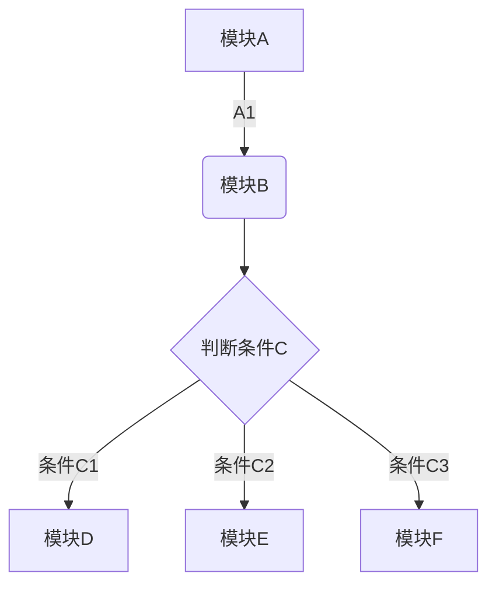
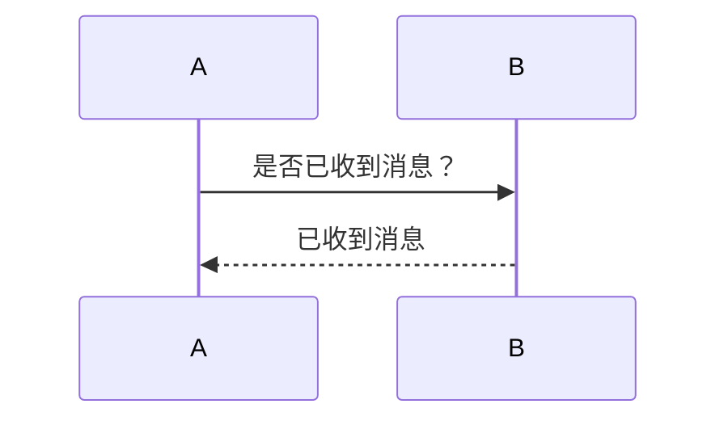
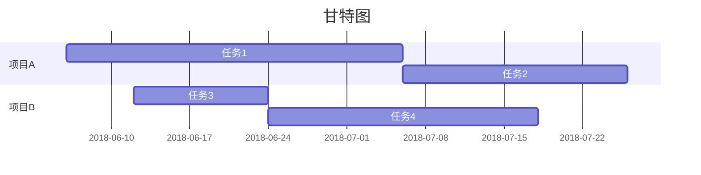

# 一级标题
## 二级标题
### 三级标题
#### 四级标题
##### 五级标题
###### 六级标题

**加粗文字**

# *斜体*
_这样也是斜体_

# <u>下划线</u>

# ~~删除线~~

***
# 分隔符
***

# `高亮`


# 引用文本
>引用文本
>...


# 数字列表
1. 数字列表
2. 符号列表
* vscode 行！
- 这个也行


# 添加代办事项
* [ ] 记笔记
* [ ] 坚持记笔记


# 插入链接
[google](www.google.com)
链接格式
[](https://travis-ci.org/joemccann/dillinger)


# 插入图片


<u>可通过以下参数控制图片大小
@w=300
@h=150
@w=200h=100
@h=100w=200</u>


# 插入表格

| 帐户类型 | 免费帐户 | 标准帐户 | 高级帐户 |
| --- | --- | --- | --- |
| 帐户流量 | 60M | 1GB | 10GB |
| 设备数目 | 2台 | 无限制 | 无限制 |
| 当前价格 | 免费 | ￥8.17/月 | ￥12.33/月|


# 插入代码
```python
#标注语言类型即可将显示格式转为对应语言
#!/usr/bin/python
import re

line = "Cats are smarter than dogs"

matchObj = re.match( r'(.*) are (.*?) .*', line, re.M|re.I)

if matchObj:
    print "matchObj.group() : ", matchObj.group()
    print "matchObj.group(1) : ", matchObj.group(1)
    print "matchObj.group(2) : ", matchObj.group(2)
else:
    print "No match!!"
```


# 添加数学公式 
具体详见[katex](https://katex.org/docs/supported.html)
```math
e^{i\pi} + 1 = 0
```


# 流程图

# 时序图

# 甘特图


# 设置目录
之后可以自动根据设置的分级标题来自动生成目录。
[TOC]
# 隐藏文字
[//]: # (此处的文字不会被看到)
参考：
- [印象笔记markdown入门指南](https://list.yinxiang.com/markdown/eef42447-db3f-48ee-827b-1bb34c03eb83.php)
- [一个在线markdown编辑工具，里面有模板](https://dillinger.io/)

# Markdown 的目录树怎么做出来

win 自带
有个shell命令叫 tree
see http://linux.die.net/man/1/tree
Mac下要装tree，不然terminal里用不了  中文乱码 tree -N